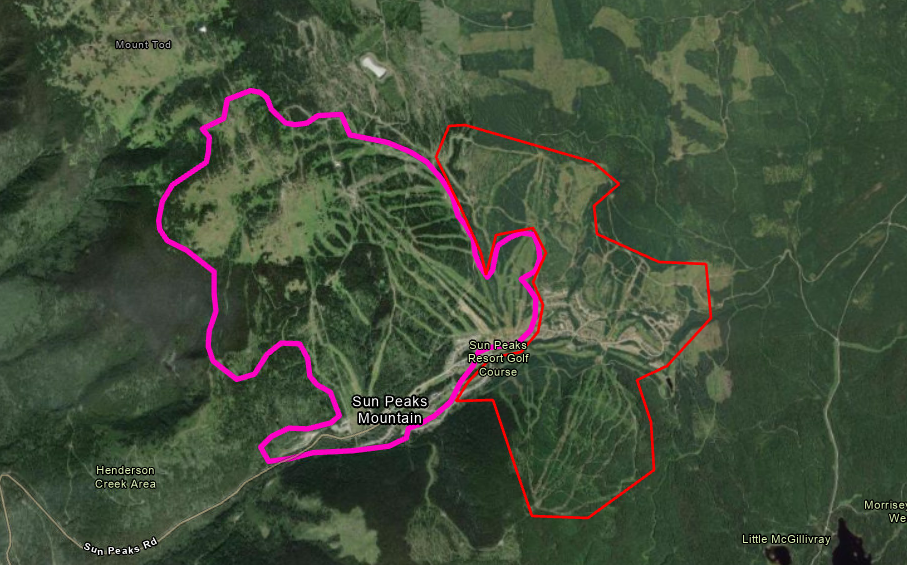
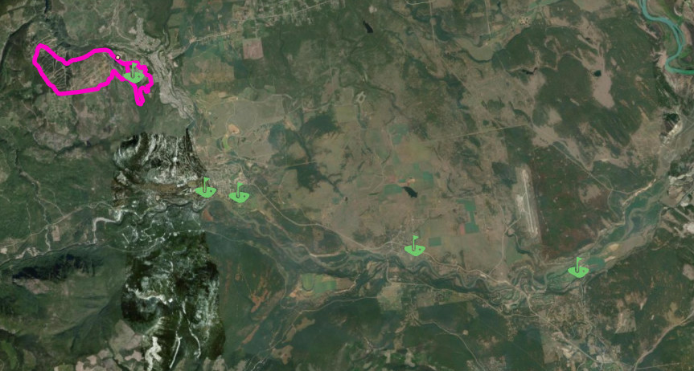
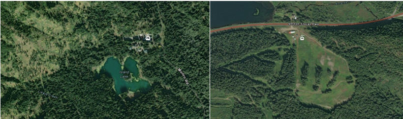

# Recreational Human Disturbance Data in BC

## Project Overview
This GitHub repository is dedicated to the research, documentation, and automation of data collection related to **recreational human disturbance** in British Columbia. As part of the broader effort led by GeoBC and the Cumulative Effects Framework (CEF), this project focuses specifically on identifying and incorporating recreational infrastructure such as ski areas, golf courses, and other outdoor facilities into the Human Disturbance dataset.

## Contacts
- **Ingrid Espinosa Malpica**: Team Lead (Product Owner)
- **Eric Millan**: Geospatial Coordinator (Technical Lead)
- **Candice Steinke**: Geomatics with Mountain Resorts Branch (Subject Matter Expert)

## Data Workspace
**Data Exploration will be completed in ArcGIS Pro, in this workspace:**
W:\srm\sry\Workarea\emillan\sandbox\CumulativeEffects_HumanDisturbance

**Current Input Layers Include**:
- [*WHSE_BASEMAPPING.BTM_PRESENT_LAND_USE_V1_SVW*](https://catalogue.data.gov.bc.ca/dataset/baseline-thematic-mapping-present-land-use-version-1-spatial-layer/resource/ed4900de-db01-4aa2-b720-c8e3210b8235): Accessed via an oracle connection in ArcGIS Pro, filtered by "PRESENT_LAND_USE_LABEL" = "Recreation Activities". There are 210 Features in this Feature Class, with a size range between 1000 Hectares (Sunpeaks Resort) to 18 Hectares. The level of development varies significantly in these features (some are virtually undeveloped).
  

  
<em>Definition of Dataset</em>

  Land used for private or public outdoor recreational purposes. Ski resorts and golf courses are included. This class does not include recreational areas within built-up portions of cities, towns and villages, which are mapped as urban areas. This class includes waterfront cottage areas if they are at least 200 metres wide.
  

  

  
<em>Evaluation of Dataset</em>

  There are significant issues with this dataset which, at times, underrepresenting the land used for recreational purposes. For example, the largest feature in this dataset is the Sun Peaks Resort Skihill and nearly half of the current skihill (red) is not represented in the dataset (pink)
   

  
  

- [WHSE_IMAGERY_AND_BASE_MAPS.GSR_GOLF_COURSES_SV](https://catalogue.data.gov.bc.ca/dataset/golf-courses/resource/e70e32f0-2ab6-4b60-9932-b584bbb921fd): Accessed via an oracle connection in ArcGIS Pro.
  

  
<em>Definition of Dataset</em>

  The location of golf courses is tracked in the sites database at GeoBC. This database identifies the physical location of the building or the access point to the property (for emergency response). This dataset is updated at the beginning of each month.
  

  

  
<em>Evaluation of Dataset</em>

  This dataset contains 295 point locations representing golfcourses throughout the process. It appears to identify many more golf courses than contained in the Baseline Thematic Mapping layer, although this could be due to the colocation of Golf Courses in urban areas (BTM explicitely states that recreational uses near urban areas are not captured under the recreation classification). This dataset may proove useful in starting off an image classifciation process (to identify the footprints of more golf courses). The image below captures the general trend of some colocation between the BTM Layer (Pink) and the Point Data contained in this dataset, and the phenomenon that there are many more golf courses identified in this layer than in BTM.
   

  
  

- [WHSE_IMAGERY_AND_BASE_MAPS.GSR_SKI_RESORTS_SV](https://catalogue.data.gov.bc.ca/dataset/ski-resorts): Accessed via an oracle connection in ArcGIS Pro.
  

  
<em>Definition of Dataset</em>

  GSR_SKI_RESORTS_SV is a spatially enabled layer comprising Ski Resorts. Ski Resorts is a point dataset identifying the location of ski resorts in British Columbia.
  

  

  
<em>Evaluation of Dataset</em>

  This dataset contains 40 point locations representing ski resorts throughout the province. There is a wide variety of types of Ski Resorts represented in this dataset, and it is almost certanily not complete. There are several features not represented in the BTM layer, including small lodges such as Island Lake (left) near Fernie, or the medium sized resorts such as Summit Lake Ski and Snowboard Area (right). There are likely many more missing Heli Ski Operators, smaller scale resorts or ski-related impacts on the landscape (eg, CMH, Spearhead Huts, etc)
   

  
  

Contacts at **Mountain Resorts Branch** communicated that they use 3rd party data to get a more complete picture of ski resorts, including [OpenStreetMap](https://www.openstreetmap.org/search?query=whistler#map=14/50.10115/-122.95864). Query for "aerialway" to view ski lifts), or [Tag:route:ski](https://wiki.openstreetmap.org/wiki/Tag:route%3Dski) for ski routes.

## Objectives
1. **Identify and assess datasets** related to recreational land use in BC.
2. **Engage with data custodians** to ensure the best available datasets are included.
3. **Develop and automate data processing workflows** using Python and geospatial tools.
4. **Integrate validated recreational disturbance data** into the larger Human Disturbance dataset.
5. **Document research findings and methodologies** for transparency and reproducibility.

## Project Scope
This repository will include:
- **Research documentation** on available datasets and validation processes.
- **Python scripts** for data extraction, transformation, and analysis.
- **Test data** where applicable to support methodology development.
- **Decision logs** outlining the reasoning behind dataset selection and exclusion.

## Workflow
### **Phase 1: Data Scoping & Research (January – April 2025)**
- Identify existing datasets for ski areas, golf courses, and other recreational sites.
- Engage with dataset custodians to assess data quality and availability.
- Document decision-making criteria for dataset inclusion.
- Conduct a gap analysis to determine missing or underrepresented data.

### **Phase 2: Data Processing & Automation (April – May 2025)**
- Develop Python scripts to standardize and preprocess recreational disturbance data.
- Automate spatial data integration workflows using GIS tools.
- Incorporate new datasets and refine data ranking methodologies.

### **Phase 3: Quality Control & Validation (May – September 2025)**
- Conduct internal reviews and collaborate with subject-matter experts.
- Test the impact of recreational disturbance data within the larger Human Disturbance dataset.
- Iterate on methodologies based on feedback and findings.

### **Phase 4: Finalization & Integration (July – December 2025)**
- Finalize dataset documentation and metadata.
- Ensure alignment with the overall Human Disturbance dataset requirements.
- Support the integration of recreational disturbance data into the final published dataset.

## Tools & Technologies
- **Python** (for data processing, automation, and analysis)
- **ArcGIS Pro / QGIS** (for spatial data processing)
- **Remote sensing & LiDAR** (for enhanced dataset validation, if applicable)
- **GeoBC & Open Data sources** (for accessing relevant spatial datasets)

## Contributing
Contributions to this repository are welcome, particularly in the areas of:
- Identifying and validating new recreational disturbance datasets.
- Improving Python scripts for data automation.
- Providing insights into data quality and classification.

If you'd like to contribute, please refer to the repository's contribution guidelines.

---
This project is a specialized component of the broader **Human Disturbance Dataset Enhancement for BC**, focusing on recreational human disturbance data to improve land-use decision-making.
